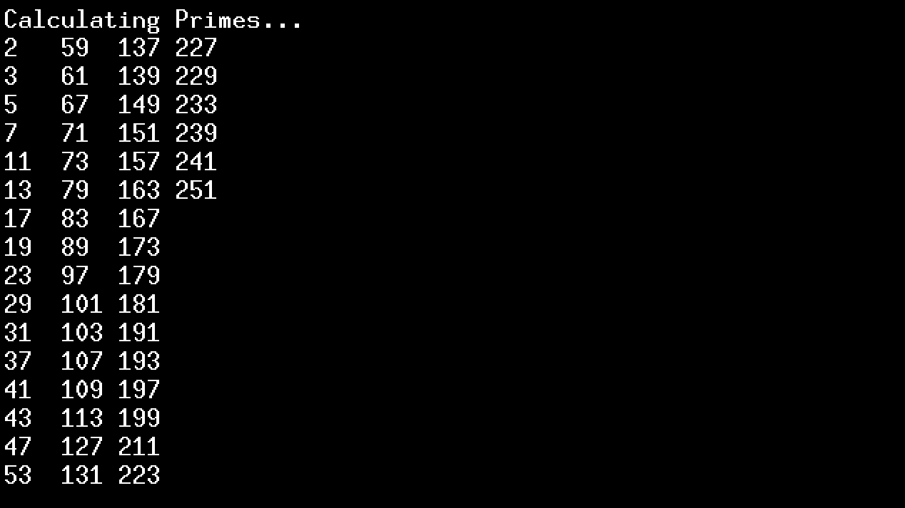

# Vircon32 8 bit Primes Calculator Test

It is a simple 8 bit prime numbers calculation test made for Vircon32

## Build Instructions

Make sure these Developer Tools:
- `compile`
- `assemble`
- `packrom`

are in your PATH variable, or run the build instructions in a virtual environment.

To build the ROM file, just run `make` in this repository folder.